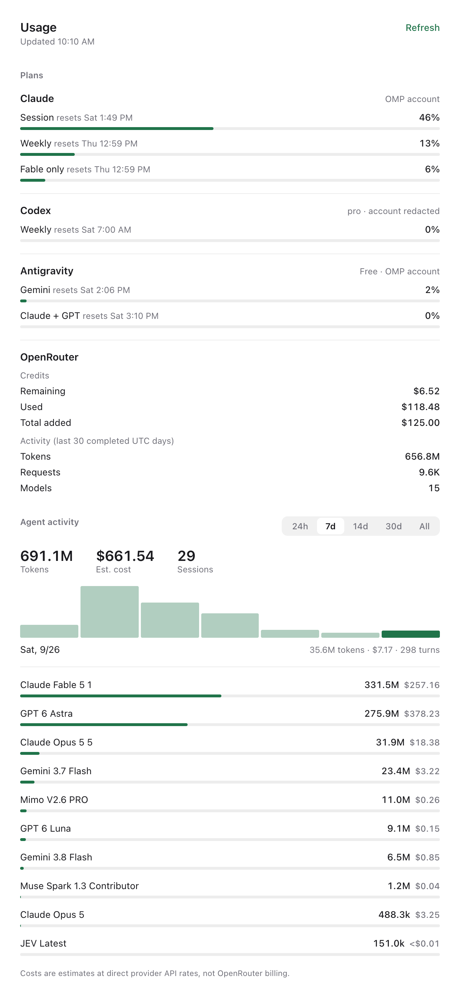

# Paseo plan usage

A [Paseo](https://paseo.sh) plugin that puts Claude, Codex, and Antigravity plan limits in the
sidebar, next to Tasks and any other sidebar contribution. One click, no menu digging, no second
window.



Each row is one quota window: the label, when it resets, the share consumed, and a zero-baseline
bar. Rows at 90% or above turn red. The account line names the plan, account, and which data
source answered.

Internal model-pool lanes such as `gpt-reserve` are hidden. Those are identifier-named
mirrors of a real window rather than limits you plan around.

## Why

Paseo already knows provider usage, but it lives behind a hover tooltip and a settings screen.
This plugin turns the same information into a persistent, keyboard-reachable sidebar surface and
adds Antigravity, which Paseo does not report.

## What it reads

Usage is fetched with the [CodexBar](https://github.com/steipete/CodexBar) CLI, which reuses
credentials you already have instead of asking for new ones.

| Provider | Source |
| --- | --- |
| Codex | The Codex CLI's own OAuth session. |
| Claude | An OAuth access token borrowed from [OMP](https://paseo.sh/omp), else CodexBar's own strategies. |
| Antigravity | The same OMP path, else CodexBar's local Antigravity probes, `agy` CLI, or Google OAuth. |

Nothing launches a GUI. Antigravity usage is read over Google's OAuth quota endpoints, so neither
the Antigravity desktop app nor an interactive `agy` session has to be running.

If OMP is not installed, the Claude and Antigravity rows fall back to CodexBar's own provider
strategies (`--source auto`) rather than failing, so the plugin is still useful on a machine that
authenticates those providers another way.

## Requirements

- A Paseo daemon with plugins enabled.
- The CodexBar CLI on `PATH` at `~/.local/bin/codexbar`, or `CODEXBAR_BIN` pointing at it.
  Linux and macOS builds are published on
  [CodexBar releases](https://github.com/steipete/CodexBar/releases).
- Optional: OMP with `anthropic` and `google-antigravity` accounts signed in, for the
  token-bridged Claude and Antigravity paths.

## Install

```bash
git clone https://github.com/nerveband/paseo-provider-usage.git
cd paseo-provider-usage
npm install
npm run typecheck
paseo plugin install "$PWD"
paseo plugin ls
```

Open the app and pick **Usage** in the sidebar, or run the **Open plan usage** action from the
Command Center (`Ctrl`/`Cmd` + `K`).

After editing the source, apply it with `paseo plugin reload provider-usage`. Do not restart the
daemon; that stops running agents.

## Configuration

| Variable | Effect |
| --- | --- |
| `CODEXBAR_BIN` | Absolute path to the CodexBar CLI. Defaults to `~/.local/bin/codexbar`. |

Providers, refresh cadence, and thresholds are code-level constants in `usage.server.ts` and
`main.client.tsx`.

## Refresh behavior

Opening the surface never blocks on a fetch. The daemon answers with the last snapshot it has
and revalidates behind it, so you read numbers immediately and see `Updating…` next to the
timestamp while fresh ones arrive. A spinner appears only on the very first run, when there is
no snapshot yet.

The snapshot is written to `$XDG_STATE_HOME/paseo-provider-usage/snapshot.json` (default
`~/.local/state/...`) with mode `0600`, so a daemon or plugin reload still paints instantly. It
holds usage numbers, reset times, and the account label — never a token.

Provider quota endpoints are rate limited per account, so fetching stays deliberately quiet:

- A snapshot under 60 seconds old is served as-is, with no upstream fetch.
- An older snapshot is served immediately and refreshed in the background.
- Concurrent requests share one in-flight fetch.
- The surface revalidates every five minutes, and polls every two seconds only while a
  background refresh is outstanding.
- **Refresh** bypasses the cache and waits for fresh numbers.

Claude's OAuth token is read from OMP's cache first. A forced token refresh mints a new access
token and invalidates the previous one, so it is used only after the provider rejects the cached
token.

## Security

- Backend plugin code is trusted and unsandboxed; it runs beside your Paseo daemon.
- Tokens are passed to CodexBar through a `0600` config file in a private temporary directory
  that is deleted after each fetch.
- Tokens are never logged, printed, or written into this repository.
- A failing provider degrades to a message on its own row; the other providers keep rendering.

## Development

```bash
npm run typecheck                      # required before install or reload
paseo plugin reload provider-usage     # apply source edits
paseo plugin logs provider-usage       # backend stdout/stderr
```

| File | Role |
| --- | --- |
| `index.ts` | Registers the RPC handler, surface, sidebar item, and Command Center action. |
| `usage.shared.ts` | Zod contract shared by both runtimes. |
| `usage.server.ts` | Token bridge, CodexBar invocation, normalization, caching. |
| `main.client.tsx` | The React Native surface. |

Verified on Linux (`x86_64`) against Paseo daemon 0.5.2 and CodexBar 0.55.1, in light and dark
themes at desktop and compact widths.

## Credits

Usage data comes from [CodexBar](https://github.com/steipete/CodexBar) by Peter Steinberger.

## License

[MIT](LICENSE)
